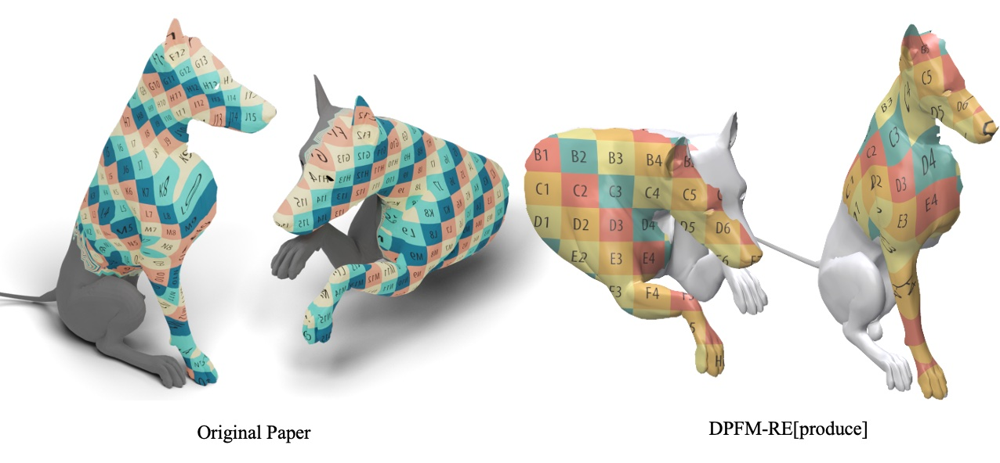

# DPFM-RE[produce]  
📌 **Reproduced DPFM with close results to the original paper.**  
<p align="center">
  
  
</p>

## Coverage  
- **Datasets**: `faust`, `scape`, `cuts`, `holes`, `cp2p`, `pfarm`  
- **Evaluation Metrics**: `Geodesic Error`, `mIoU`
- **Visualizations**: `texture`

## Downalod & unzip all datasets
```bash
bash dataset.sh
```
```Shell
├── data
    ├── FAUST_r
    ├── SCAPE_r
    ├── SHREC16
    ├── SHREC16_test
    ├── CP2P
    ├── CP2P_test
    ├── pfarm
```
We thank the original dataset providers for their contributions to the shape analysis community, and that all credits should go to the the respective authors and contributors.


## Preprocess
All needed computations (e.g. eigenfunctions, geodesic distances) are automatically computed and cached on the fly. However, if you want to precompute them ahead of time, here is a script to iterate through the dataset.
```python
python preprocess.py --opt options/dpfm/train/cp2p.yaml
```

## Train
```python
python train.py --opt options/dpfm/train/cp2p.yaml
```
You can visualize the training process in tensorboard or via wandb.
```bash
tensorboard --logdir experiments/
```

## Test
```python
python test.py --opt options/dpfm/test/cp2p.yaml
```
The qualitative and quantitative results will be saved in [results](results) folder.


## Visualization
Make sure to install the latest [polyscope](https://github.com/nmwsharp/polyscope) to allow headless rendering.
```
pip uninstall polyscope
pip install git+https://github.com/nmwsharp/polyscope-py.git
```
To generate visualizations for test dataset.
```python
python visualize.py --opt options/dpfm/test/cp2p.yaml
```
The visualized images will be saved in [results](results) folder.
## Pretrained models
You can find all pre-trained models in [checkpoints](checkpoints) for reproducibility.

## ✅ Done  
- fix nn_interpolate bug
- fix nce_loss bug
- `cp2p` test  
- Geodesic Error  
- PCK Curve  
- mIoU & mIoU Curve  
- visualization script  
- fix overlap loss bug
- Training script
- cuts holes configs
- custom collate function
- refactor diffsion file loading (optional: use evecs from dataset, load diff from verts and faces)
- augmentation code
- xyz augmentation transformation refactors:
- verts as unique identifier for loading shape properties
- xyz as the thing to freely transfrom, augment, anywhere in the pipeline, dataset, model, diffusion net, etc. 
- preprocess script with simple iteration
- dataset upload (shrec16 from ulrssm, cp2p and pfarm are mit licensed)
- a cache wrapper func for easy cache usage
- clean up the shape quantity caching and loading logic
- fix random seed for xyz test augmentations for consistent results
apparently test augmentations reproducibility and variability is not easy to implement....
solution: use deterministic hash to get reproducible seed for each pair, just like our cache logic.
- refactor diffusionnet
- discovered a bug in ulrssm diffusionnet, the gradient rotation is not applied correctly. We stick to original official diffusionnet implementation from nmwsharp and dpfm for the future. 
- refactor diffusionnet, dpfm signatures
- will not do it. optional preprocess script with dataloader to enable parallel preprocess with multiple workers: tried it, but there is no real difference on my machine, so rather keep it simple
- save best model logic
- shrec16 dataset
- faust
- scape 
- usuage guide

## 🔨 TODO  
- pfarm
- faust scape test configs
- cuts holes ckpts faust scape
- better readme (acknowledgements)
- run everything
---
- propogate rest of shape dataset loading logic to other datasets
- evecs number balance in visualization
- val loss logging

