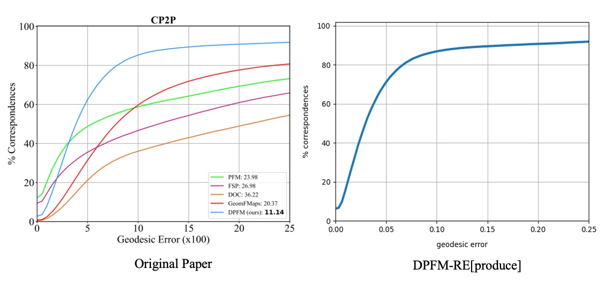

# DPFM-RE[produce]  
📌 **Reproduced DPFM with close results to the original paper.**  

  
  

## Scope  
- **Datasets**: `cuts`, `holes`, `cp2p`, `pfarm`  
- **Evaluation Metrics**:  
  - Geodesic Error  
  - PCK Curve  
  - mIoU & mIoU Curve  
- **Visualizations**: A script for generating figures  

## ✅ Done  
- fix nn_interpolate bug
- fix nce_loss bug
- `cp2p` test  
- Geodesic Error  
- PCK Curve  
- mIoU & mIoU Curve  
- visualization script  
- fix overlap loss bug
- Training script
- cuts holes configs
- custom collate function
- refactor diffsion file loading (optional: use evecs from dataset, load diff from verts and faces)
- augmentation code
- xyz augmentation transformation refactors:
- verts as unique identifier for loading shape properties
- xyz as the thing to freely transfrom, augment, anywhere in the pipeline, dataset, model, diffusion net, etc. 
- preprocess script with simple iteration
- dataset upload (shrec16 from ulrssm, cp2p and pfarm are mit licensed)

## 🔨 TODO  
- cuts holes ckpts
- pfarm
- better readme
- refactor diffusionnet
- evecs number balance in visualization
- acknowledgements
- optional preprocess script with dataloader to enable parallel preprocess with multiple workers
